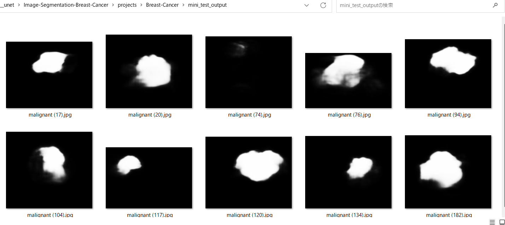
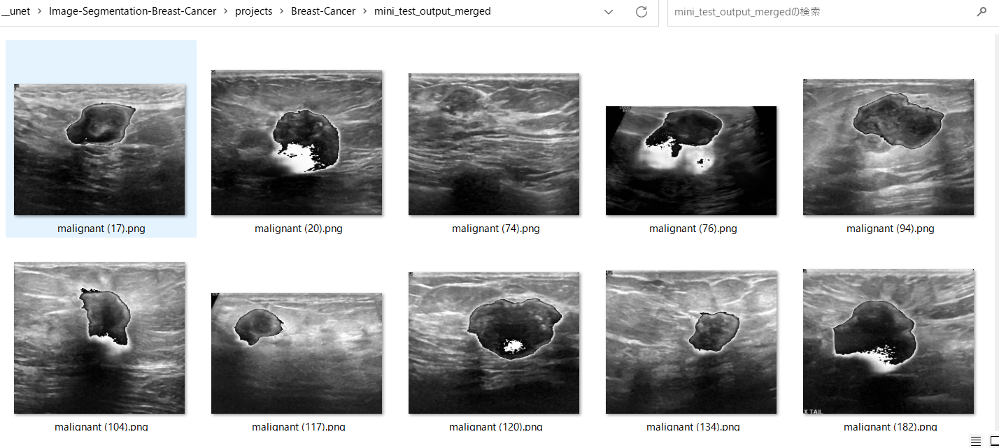

# Image-Segmentation-Breast-Cancer (Updated: 2023/06/16)
<h2>
1 Image-Segmentation-Breast-Cancer
</h2>
This is an experimental project to detect <b>Breast Cancer</b> based on 
Breast Ultrasound Images Dataset (BUSI), by using our <a href="https://github.com/atlan-antillia/Tensorflow-Slightly-Flexible-UNet">Tensorflow-Slightly-Flexible-UNet Model.</a> 
The original dataset used here has been taken from the following web site: 
<b>Breast Ultrasound Images Dataset</b> 
Breast ultrasound images for classification, detection & segmentation 

<pre>
https://www.kaggle.com/datasets/aryashah2k/breast-ultrasound-images-dataset
</pre>
Citation: 
<pre>
Al-Dhabyani W, Gomaa M, Khaled H, Fahmy A. 
Dataset of breast ultrasound images. Data in Brief. 
2020 Feb;28:104863. 
DOI: 10.1016/j.dib.2019.104863.
</pre>

See also:

<pre>
U-Net: Convolutional Networks for Biomedical Image Segmentation
 https://arxiv.org/pdf/1505.04597.pdf
</pre>
<ul>
<li>2023/05/24: Modified to write the merged (image+mask) inferred image files.</li>
<li>2023/06/16: Created ./projects/Brain-Cancer folder.</li>
<li>2023/06/16: Modified to use ImageMaskDataset instead of BrainCancerDatset.</li>

</ul>
 
<h2>
2. Install Image-Segmentation-Breast-Cancer
</h2>
Please clone Image-Segmentation-Breast-Cancer.git in the working folder <b>c:\google</b>. 
<pre>
>git clone https://github.com/atlan-antillia/Image-Segmentation-Breast-Cancer.git 
</pre>
You can see the following folder structure in your working folder. 

</h2>
<pre>
Image-Segmentation-Breast-Cancer
├─asset
└─projects
    └─Breast-Cancer
        ├─Breast-Cancer
        │  ├─test
        │  │  └─malignant
        │  │      ├─images
        │  │      └─masks
        │  └─train
        │      └─malignant
        │          ├─images
        │          └─masks
        ├─eval
        ├─mini_test
        ├─mini_test_output
        ├─mini_test_output_merged
        ├─models
        └─preprocessors
            └─Dataset_BUSI_with_GT
</pre>
 
<h2>
3 Prepare dataset
</h2>

<h3>
3.1 Download master dataset
</h3>
 Please download the original dataset from the following link 
<pre>
https://www.kaggle.com/datasets/aryashah2k/breast-ultrasound-images-dataset
</pre>
<b>Dataset_BUSI_with_GT</b> dataset has the following folder structure. 
<pre>
Dataset_BUSI_with_GT
├─benign
├─malignant
└─normal
</pre>
For example, <b>malignant</b> folder contains Breast Ultrasound image files and corressponding mask files
as show below. 
 

<h3>
3.2 Split master dataset
</h3>
For simplicity, we have resized, augmented and split the original <b>malignant</b> only in <b>Dataset_BUSI_with_GT</b>
 dataset to <b>train</b> and <b>test</b> dataset 
by using Python script <a href="./preprocessors/create_augmented_master_256x256.py">create_augmented_master_256x256.py</a>.
<pre>
BUSI_augmented_master_256x256
├─test
│  └─malignant
└─train
    └─malignant
</pre>
<h3>
3.3 Split master to images and masks
</h3>
Furthermore, we have split image files in each <b>malignant</b> folder to <b>images</b> and <b>masks</b> 
by using Python script <a href="./preprocessors/split_to_images_masks.py">split_to_images_masks.py</a>.
<pre>
Breast-Cancer
├─test
│  └─malignant
│      ├─images
│      └─masks
└─train
    └─malignant
        ├─images
        └─masks
</pre>
<b>Samples of augmented train/malignant/images</b> 
 
 
<b>Samples of augmented train/malignant/masks</b> 
 

<b>Breast-Cancer dataset inspection</b> 
 

 
<h2>
4 Train TensorflowUNet Model
</h2>
 We have trained Breast-Cancer TensorflowUNet Model by using the following
 <b>train_eval_infer.config</b> file.  
Please run the following bat file. 
<pre>
>1.train.bat
</pre>
, which simply runs the following command. 
<pre>
>python ../../TensorflowUNetTrainer.py train_eval_infer.config
</pre>

<pre>
; train_eval_infer.config
; 2023/6/15 antillia.com
; Modified to use loss and metric
; Specify loss as a function nams
; loss =  "binary_crossentropy"
; Specify metrics as a list of function name
; metrics = ["binary_accuracy"]
; Please see: https://www.tensorflow.org/api_docs/python/tf/keras/Model?version=stable#compile

[model]
image_width    = 256
image_height   = 256
image_channels = 3
num_classes    = 1
base_filters   = 16
num_layers     = 6
dropout_rate   = 0.08
learning_rate  = 0.001
loss           = "binary_crossentropy"
metrics        = ["binary_accuracy"]
show_summary   = False

[train]
epochs        = 100
batch_size    = 4
patience      = 10
metrics       = ["binary_accuracy", "val_binary_accuracy"]
model_dir     = "./models"
eval_dir      = "./eval"
image_datapath = "./Breast-Cancer/train/malignant/images/"
mask_datapath  = "./Breast-Cancer/train/malignant/masks/"

[eval]
image_datapath = "./Breast-Cancer/test/malignant/images/"
mask_datapath  = "./Breast-Cancer/test/malignant/masks/"

[infer] 
images_dir    = "./mini_test" 
output_dir    = "./mini_test_output"
merged_dir    = "./mini_test_output_merged"

[mask]
blur      = True
binarize  = True
threshold = 100
</pre>

Since <pre>loss = "binary_crossentropy"</pre> and <pre>metrics = ["binary_accuracy"] </pre> are specified 
in <b>train_eval_infer.config</b> file,
<b>binary_crossentropy</b> and <b>binary_accuracy</b> functions are used to compile our model as shown below.
<pre>
    # Read a loss function name from a config file, and eval it.
    # loss = "binary_crossentropy"
    self.loss  = eval(self.config.get(MODEL, "loss"))

    # Read a list of metrics function names from a config file, and eval each of the list,
    # metrics = ["binary_accuracy"]
    metrics  = self.config.get(MODEL, "metrics")
    self.metrics = []
    for metric in metrics:
      self.metrics.append(eval(metric))
        
    self.model.compile(optimizer = self.optimizer, loss= self.loss, metrics = self.metrics)
</pre>
You can also specify other loss and metrics functions in the config file. 
Example: basnet_hybrid_loss(https://arxiv.org/pdf/2101.04704.pdf) 
<pre>
loss         = "basnet_hybrid_loss"
metrics      = ["dice_coef", "sensitivity", "specificity"]
</pre>
On detail of these functions, please refer to <a href="./losses.py">losses.py</a> , and 
<a href="https://github.com/shruti-jadon/Semantic-Segmentation-Loss-Functions/tree/master">Semantic-Segmentation-Loss-Functions (SemSegLoss)</a>.

We have also used Python <a href="./BreastCancerDataset.py">BreastCancerDataset.py</a> script to create
train and test dataset from the original and segmented images specified by
<b>image_datapath</b> and <b>mask_datapath </b> parameters in the configratration file. 
The training process has just been stopped at epoch 24 by an early-stopping callback as shown below.  
 
 
The <b>val_binary_accuracy</b> is very high as shown below from the beginning of the training. 
<b>Train accuracy line graph</b>: 
 

 
The val_loss is also very low as shown below from the beginning of the training. 
<b>Train losses line graph</b>: 
 

<h2>
5 Evaluation
</h2>
 We have evaluated prediction accuracy of our Pretrained Breast-Cancer Model by using <b>test</b> dataset.
Please run the following bat file. 
<pre>
>2.evalute.bat
</pre>
, which simply runs the following command. 
<pre>
>python .,/../TensorflowUNetEvaluator.py train_eval_infer.config
</pre>
The evaluation result of this time is the following. 
 
 

<h2>
6 Inference 
</h2>
We have also tried to infer the segmented region for <b>mini_test</b> dataset, which is a very small dataset including only ten images extracted from <b>test</b> dataset,
 by using our Pretrained Breast-Cancer Model. 
<pre>
>3.infer.bat
</pre>
, which simply runs the following command. 
<pre>
>python ../../TensorflowUNetInferencer.py train_eval_infer.config
</pre>

<b>Input images (mini_test) </b> 
 
 
<b>Inferred images (mini_test_output)</b> 
  

 
<b>Merged inferred images</b> 
  

 

<!--
-->

<h3>
References
</h3>
<b>1. Breast Ultrasound Images Dataset</b> 
<pre>
https://www.kaggle.com/datasets/aryashah2k/breast-ultrasound-images-dataset
</pre>

<b>2. Breast lesion detection using an anchor-free network from ultrasound images with segmentation-based enhancement</b> 
Yu Wang & Yudong Yao 
<pre>
https://www.nature.com/articles/s41598-022-18747-y
</pre>

<b>3. Classification of Breast Cancer Ultrasound Images with Deep Learning-Based Models </b> 
Fatih Uysa,and Mehmet Murat Köse 
<pre>
https://www.mdpi.com/2673-4591/31/1/8/html
</pre>

<b>4. A CNN Deep Learning Technique for Prediction of Breast Cancer using Ultrasound Image
</b> 
Atisham Khan and Silky Pareyani 
<pre>
https://www.jetir.org/papers/JETIR2303813.pdf
</pre>

<b>5. Discrimination of Breast Cancer Based on Ultrasound Images and Convolutional Neural Network
</b> 
Rui Du,Yanwei Chen,Tao Li, Liang Shi,Zhengdong Fei,and Yuefeng Li
 
<pre>
https://www.hindawi.com/journals/jo/2022/7733583/
</pre>

<b>6. EfficientDet-Augmented-Breast-Ultrasound-Images
</b> 
Toshiyuki Arai @antillia.com
 
<pre>
https://github.com/sarah-antillia/EfficientDet-Augmented-Breast-Ultrasound-Images
</pre>

<b>7. Semantic-Segmentation-Loss-Functions (SemSegLoss)</b> 
<pre>
https://github.com/shruti-jadon/Semantic-Segmentation-Loss-Functions
</pre>
<pre>
Citation
@inproceedings{jadon2020survey,
  title={A survey of loss functions for semantic segmentation},
  author={Jadon, Shruti},
  booktitle={2020 IEEE Conference on Computational Intelligence in Bioinformatics and Computational Biology (CIBCB)},
  pages={1--7},
  year={2020},
  organization={IEEE}
}
@article{JADON2021100078,
title = {SemSegLoss: A python package of loss functions for semantic segmentation},
journal = {Software Impacts},
volume = {9},
pages = {100078},
year = {2021},
issn = {2665-9638},
doi = {https://doi.org/10.1016/j.simpa.2021.100078},
url = {https://www.sciencedirect.com/science/article/pii/S2665963821000269},
author = {Shruti Jadon},
keywords = {Deep Learning, Image segmentation, Medical imaging, Loss functions},
abstract = {Image Segmentation has been an active field of research as it has a wide range of applications, 
ranging from automated disease detection to self-driving cars. In recent years, various research papers 
proposed different loss functions used in case of biased data, sparse segmentation, and unbalanced dataset. 
In this paper, we introduce SemSegLoss, a python package consisting of some of the well-known loss functions 
widely used for image segmentation. It is developed with the intent to help researchers in the development 
of novel loss functions and perform an extensive set of experiments on model architectures for various 
applications. The ease-of-use and flexibility of the presented package have allowed reducing the development 
time and increased evaluation strategies of machine learning models for semantic segmentation. Furthermore, 
different applications that use image segmentation can use SemSegLoss because of the generality of its 
functions. This wide range of applications will lead to the development and growth of AI across all industries.
}
}
</pre>
 

<h2>
Appendix
</h2>
<h3>Model summary</h3>
Please run the following command to see the summary of TensorflowUNet Model
defined by <b>train_eval_infer.config</b>.  
<pre>
>python TensorflowUNet.py
</pre>
<a href="./asset/model.png">Model Visualization</a>
<pre>
__________________________________________________________________________________________________
 Layer (type)                   Output Shape         Param #     Connected to
==================================================================================================
 input_1 (InputLayer)           [(None, 256, 256, 3  0           []
                                )]

 lambda (Lambda)                (None, 256, 256, 3)  0           ['input_1[0][0]']

 conv2d (Conv2D)                (None, 256, 256, 16  448         ['lambda[0][0]']
                                )

 dropout (Dropout)              (None, 256, 256, 16  0           ['conv2d[0][0]']
                                )

 conv2d_1 (Conv2D)              (None, 256, 256, 16  2320        ['dropout[0][0]']
                                )

 max_pooling2d (MaxPooling2D)   (None, 128, 128, 16  0           ['conv2d_1[0][0]']
                                )

 conv2d_2 (Conv2D)              (None, 128, 128, 32  4640        ['max_pooling2d[0][0]']
                                )

 dropout_1 (Dropout)            (None, 128, 128, 32  0           ['conv2d_2[0][0]']
                                )

 conv2d_3 (Conv2D)              (None, 128, 128, 32  9248        ['dropout_1[0][0]']
                                )

 max_pooling2d_1 (MaxPooling2D)  (None, 64, 64, 32)  0           ['conv2d_3[0][0]']

 conv2d_4 (Conv2D)              (None, 64, 64, 64)   18496       ['max_pooling2d_1[0][0]']

 dropout_2 (Dropout)            (None, 64, 64, 64)   0           ['conv2d_4[0][0]']

 conv2d_5 (Conv2D)              (None, 64, 64, 64)   36928       ['dropout_2[0][0]']

 max_pooling2d_2 (MaxPooling2D)  (None, 32, 32, 64)  0           ['conv2d_5[0][0]']

 conv2d_6 (Conv2D)              (None, 32, 32, 128)  73856       ['max_pooling2d_2[0][0]']

 dropout_3 (Dropout)            (None, 32, 32, 128)  0           ['conv2d_6[0][0]']

 conv2d_7 (Conv2D)              (None, 32, 32, 128)  147584      ['dropout_3[0][0]']

 max_pooling2d_3 (MaxPooling2D)  (None, 16, 16, 128)  0          ['conv2d_7[0][0]']

 conv2d_8 (Conv2D)              (None, 16, 16, 256)  295168      ['max_pooling2d_3[0][0]']

 dropout_4 (Dropout)            (None, 16, 16, 256)  0           ['conv2d_8[0][0]']

 conv2d_9 (Conv2D)              (None, 16, 16, 256)  590080      ['dropout_4[0][0]']

 max_pooling2d_4 (MaxPooling2D)  (None, 8, 8, 256)   0           ['conv2d_9[0][0]']

 conv2d_10 (Conv2D)             (None, 8, 8, 512)    1180160     ['max_pooling2d_4[0][0]']

 dropout_5 (Dropout)            (None, 8, 8, 512)    0           ['conv2d_10[0][0]']

 conv2d_11 (Conv2D)             (None, 8, 8, 512)    2359808     ['dropout_5[0][0]']

 max_pooling2d_5 (MaxPooling2D)  (None, 4, 4, 512)   0           ['conv2d_11[0][0]']

 conv2d_12 (Conv2D)             (None, 4, 4, 1024)   4719616     ['max_pooling2d_5[0][0]']

 dropout_6 (Dropout)            (None, 4, 4, 1024)   0           ['conv2d_12[0][0]']

 conv2d_13 (Conv2D)             (None, 4, 4, 1024)   9438208     ['dropout_6[0][0]']

 conv2d_transpose (Conv2DTransp  (None, 8, 8, 512)   2097664     ['conv2d_13[0][0]']
 ose)

 concatenate (Concatenate)      (None, 8, 8, 1024)   0           ['conv2d_transpose[0][0]',
                                                                  'conv2d_11[0][0]']

 conv2d_14 (Conv2D)             (None, 8, 8, 512)    4719104     ['concatenate[0][0]']

 dropout_7 (Dropout)            (None, 8, 8, 512)    0           ['conv2d_14[0][0]']

 conv2d_15 (Conv2D)             (None, 8, 8, 512)    2359808     ['dropout_7[0][0]']

 conv2d_transpose_1 (Conv2DTran  (None, 16, 16, 256)  524544     ['conv2d_15[0][0]']
 spose)

 concatenate_1 (Concatenate)    (None, 16, 16, 512)  0           ['conv2d_transpose_1[0][0]',
                                                                  'conv2d_9[0][0]']

 conv2d_16 (Conv2D)             (None, 16, 16, 256)  1179904     ['concatenate_1[0][0]']

 dropout_8 (Dropout)            (None, 16, 16, 256)  0           ['conv2d_16[0][0]']

 conv2d_17 (Conv2D)             (None, 16, 16, 256)  590080      ['dropout_8[0][0]']

 conv2d_transpose_2 (Conv2DTran  (None, 32, 32, 128)  131200     ['conv2d_17[0][0]']
 spose)

 concatenate_2 (Concatenate)    (None, 32, 32, 256)  0           ['conv2d_transpose_2[0][0]',
                                                                  'conv2d_7[0][0]']

 conv2d_18 (Conv2D)             (None, 32, 32, 128)  295040      ['concatenate_2[0][0]']

 dropout_9 (Dropout)            (None, 32, 32, 128)  0           ['conv2d_18[0][0]']

 conv2d_19 (Conv2D)             (None, 32, 32, 128)  147584      ['dropout_9[0][0]']

 conv2d_transpose_3 (Conv2DTran  (None, 64, 64, 64)  32832       ['conv2d_19[0][0]']
 spose)

 concatenate_3 (Concatenate)    (None, 64, 64, 128)  0           ['conv2d_transpose_3[0][0]',
                                                                  'conv2d_5[0][0]']

 conv2d_20 (Conv2D)             (None, 64, 64, 64)   73792       ['concatenate_3[0][0]']

 dropout_10 (Dropout)           (None, 64, 64, 64)   0           ['conv2d_20[0][0]']

 conv2d_21 (Conv2D)             (None, 64, 64, 64)   36928       ['dropout_10[0][0]']

 conv2d_transpose_4 (Conv2DTran  (None, 128, 128, 32  8224       ['conv2d_21[0][0]']
 spose)                         )

 concatenate_4 (Concatenate)    (None, 128, 128, 64  0           ['conv2d_transpose_4[0][0]',
                                )                                 'conv2d_3[0][0]']

 conv2d_22 (Conv2D)             (None, 128, 128, 32  18464       ['concatenate_4[0][0]']
                                )

 dropout_11 (Dropout)           (None, 128, 128, 32  0           ['conv2d_22[0][0]']
                                )

 conv2d_23 (Conv2D)             (None, 128, 128, 32  9248        ['dropout_11[0][0]']
                                )

 conv2d_transpose_5 (Conv2DTran  (None, 256, 256, 16  2064       ['conv2d_23[0][0]']
 spose)                         )

 concatenate_5 (Concatenate)    (None, 256, 256, 32  0           ['conv2d_transpose_5[0][0]',
                                )                                 'conv2d_1[0][0]']

 conv2d_24 (Conv2D)             (None, 256, 256, 16  4624        ['concatenate_5[0][0]']
                                )

 dropout_12 (Dropout)           (None, 256, 256, 16  0           ['conv2d_24[0][0]']
                                )

 conv2d_25 (Conv2D)             (None, 256, 256, 16  2320        ['dropout_12[0][0]']
                                )

 conv2d_26 (Conv2D)             (None, 256, 256, 1)  17          ['conv2d_25[0][0]']

==================================================================================================
</pre>

